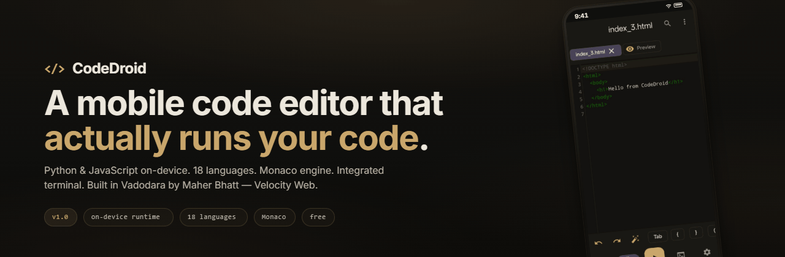
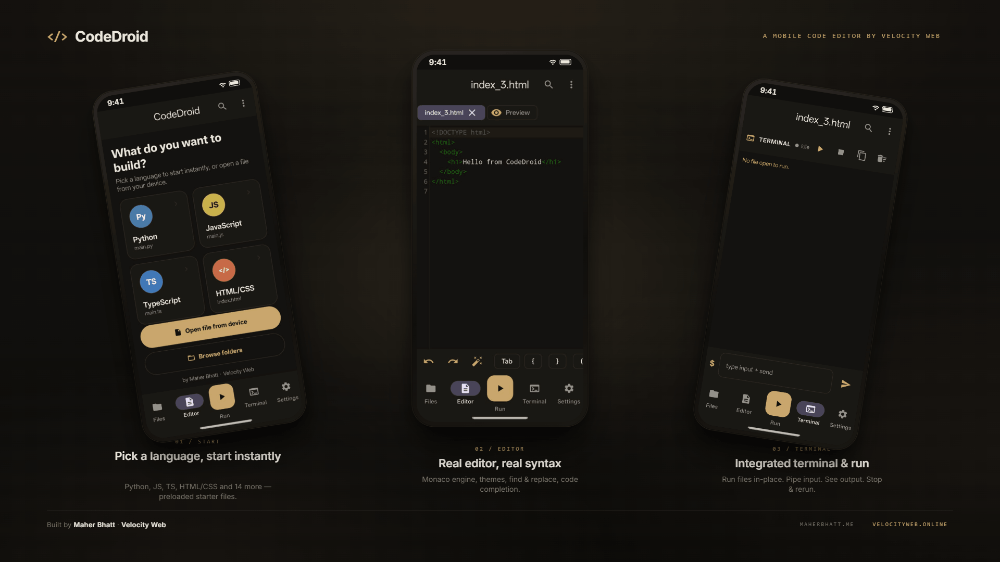

<div align="center">



# `</>` CodeDroid

### A mobile code editor for Android - write & run code on your phone.

[](https://github.com/Maher-Bhatt/CodeDroid/releases/latest)
[](https://github.com/Maher-Bhatt/CodeDroid/releases)


**[Download the latest APK](https://github.com/Maher-Bhatt/CodeDroid/releases/latest)**

</div>

---

## What is CodeDroid?

CodeDroid turns your phone into a real coding environment. Open a file, write code,
hit **Run** - Python and JavaScript execute **on-device**, and every other language
runs through a free cloud runner. The editor works **fully offline**.

## Features

- **Run on device (offline):** Python (Chaquopy) and JavaScript (Rhino)
- **Run in the cloud:** C, C++, Java, Kotlin, Go, Rust, PHP, Ruby, Swift, Dart, TypeScript, SQL (via the free Piston API)
- **Offline editor** - CodeMirror bundled locally, no internet needed to write code
- **Autocomplete** + **Vim keybindings** (toggle in Settings)
- **18 languages** with syntax highlighting
- **Python packages:** numpy, pandas, requests, pillow, sympy bundled - **plus install any pure-Python package at runtime** (Settings - Python packages)
- **Integrated terminal** - colored output, stdin, stop/clear/copy
- **File tabs that persist** across restarts, find & replace, undo/redo, code folding, auto-close brackets
- **Live HTML/CSS preview**
- **Warm dark theme**, JetBrains Mono, coding keyboard toolbar

## Install

1. Download `app-release.apk` from the [Releases](https://github.com/Maher-Bhatt/CodeDroid/releases/latest) page.
2. Open it - allow **"install from unknown source"** - Install.
3. Android 8+ (arm64). Cloud languages + runtime package install need internet; the editor + Python/JS work offline.

## Showcase

<div align="center">

</div>

## Tech stack

| Layer | Tech |
|-------|------|
| UI | Kotlin - Jetpack Compose - Material 3 |
| Editor | CodeMirror 5 (bundled, in a WebView) |
| Python | Chaquopy + runtime pure-Python pip |
| JavaScript | Rhino |
| Other languages | Piston cloud API |
| Storage | Storage Access Framework - DataStore |

## Build from source

```bash
git clone https://github.com/Maher-Bhatt/CodeDroid.git
# Open in Android Studio, let Gradle sync, then Run.
```

## Roadmap

- [ ] Self-hosted backend for unlimited packages + all languages
- [ ] Git integration

---

<div align="center">

Built by **Maher Bhatt** - **Velocity Web**

</div>
